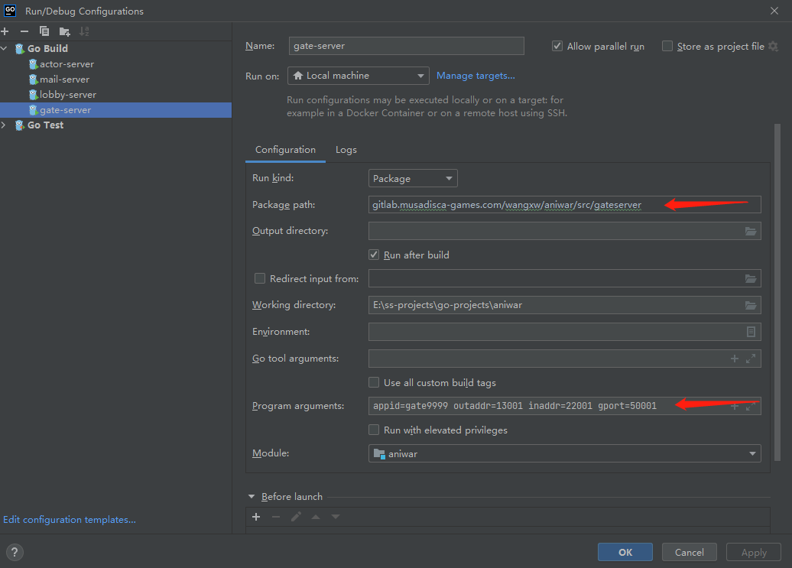
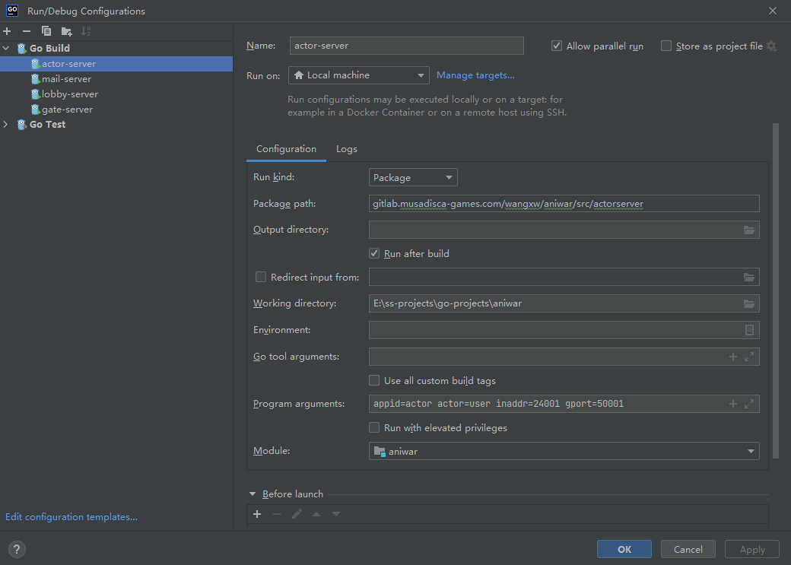
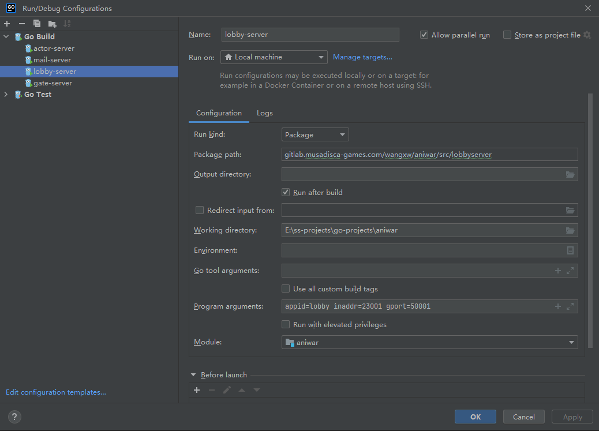
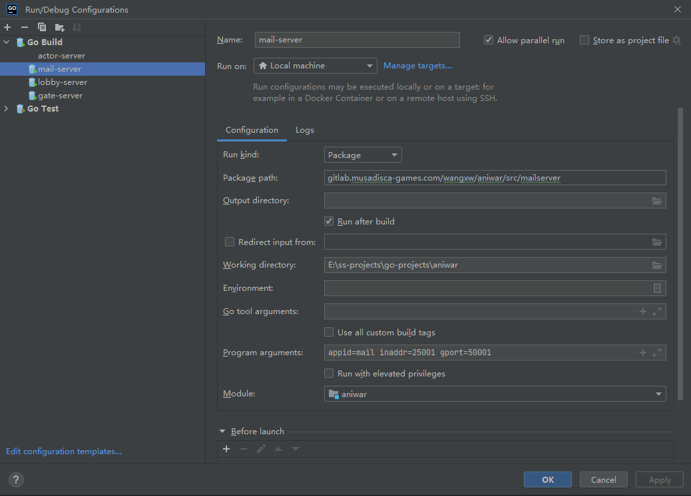

# **调试配置**及步骤
## 调试gate
* 修改```start.bat```中的**GATE_APPID**值，使其与编辑器中的参数**appid**对应
* **调试配置**:```appid=gate9999 outaddr=13001 inaddr=22001 gport=50001```

* **执行脚本**:```start.bat g```

## 调试actor
* **调试配置**:```appid=actor actor=user inaddr=24001 gport=50001```

* **执行脚本**: ```start.bat a```

## 调试lobby
* **调试配置**:```appid=lobby inaddr=23001 gport=50001```

* **执行脚本**: ```start.bat l```

## 调试mail
* **调试配置**:```appid=mail inaddr=25001 gport=50001```

* **执行脚本**: ```start.bat m```
